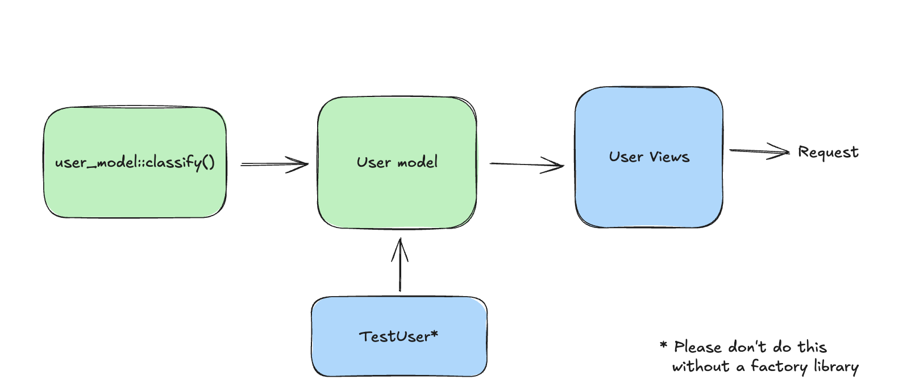
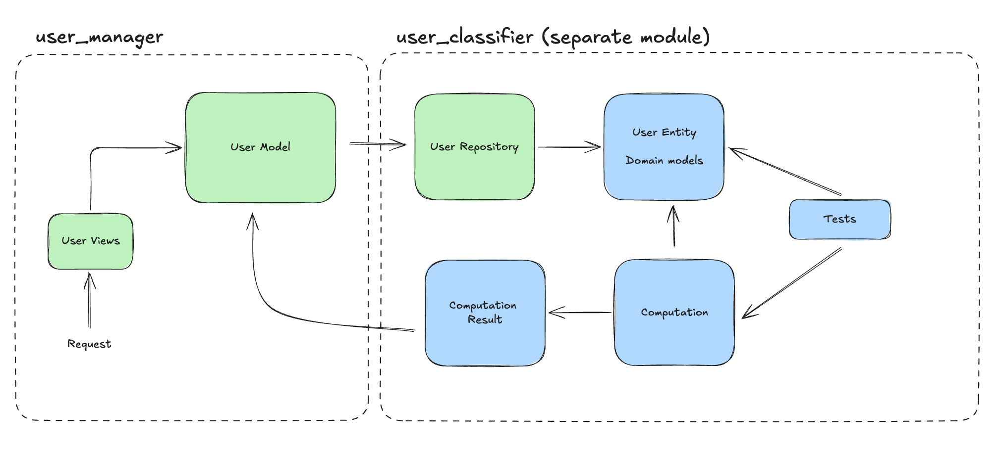
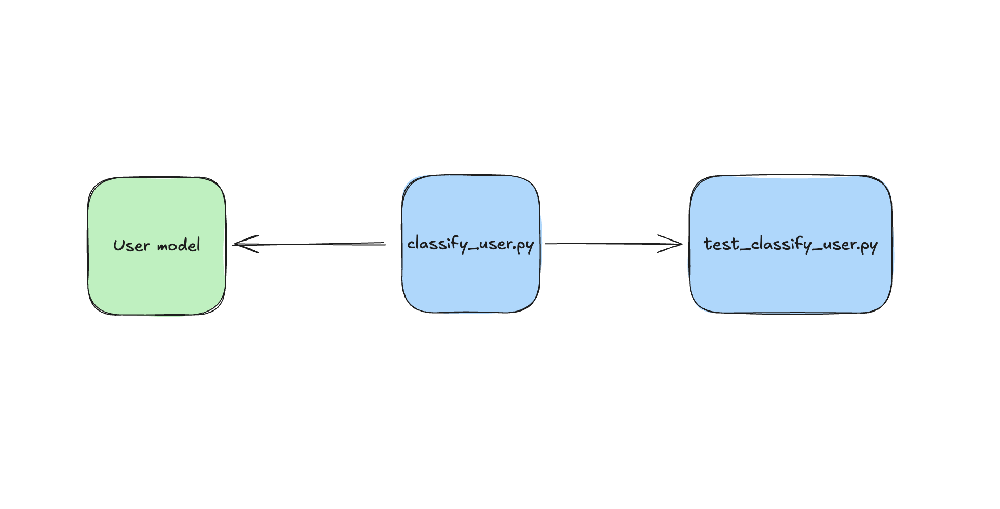

If you spent any time setting yourself up for success in your backend framework of choice, you'll find one of the most common and paradoxical advice out there i.e. "Write code that is framework agnostic". Essentially the advice is to find a way to ignore the framework and write code in a way that is easily understood with minimal knowledge of the framework. I have been a backend developer for three years and have primarily used Django to ship code for an Enterprise SaaS product. The TLDR of what I've learned in these three years is: it depends.

Yep, you can stop reading now. That's it. There is no one-size-fits-all approach to shipping software and there is definitely not a single approach that is heads and shoulders above the others. To elaborate, I will describe my experience using the following approaches in Django:
1. Fat models
2. Clean Architecture
3. Service Layer

For context, our product spans a quarter of a million LoC and we are a team of 20+ engineers. We use all three approaches in our codebase due to varying needs.

Now, to be fair, 2 and 3 are pretty similar but I feel there is a nuanced difference which I'll go into soon. Let's discuss the first approach i.e. fat-models

## Fat Models
This is the approach you will be expected to take when you start reading the official Django reference for the first time. In this approach, business logic is coupled with framework code as the methods on the model classes handle the I/O as well as the logic. An often underrated benefit of this approach is it fits the Django philosphy and their slogan "...for perfectionists with deadlines". This is a quick way to get things up and running and build out your first feature using Django. I would recommend using this approach if you're just learning stuff or need to ship/prototype quickly. It gets the job done for what it's worth.

The most common problem here is testing. Waiting for Django to set up a test database and run all the migrations just to execute a few tests is tedious and slow. As a result, you'll often find yourself unmotivated to write tests in this setup.


*Fat models*

Here's how a `classify_user` utility would look in the fat models approach:

```python
# models.py
class User(models.Model):
    email = models.EmailField()
    age = models.IntegerField()
    subscription_type = models.CharField(max_length=50)
    
    def classify_user(self):
        # Business logic for user classification
        # Returns user category based on age, subscription, etc.
        pass
```

_Key Takeaway: you're just starting out but not sure how far you'll take your project, use the fat-models approach for rapid prototyping and pair it with a good set of libraries to mitigate the pitfalls. You will have time to improve your codebase but that can always be done later._

## Clean Architecture
This has been a surprisingly polarizing topic in my team. On the surface, clean architecture seems the perfect mitigation of all the pitfalls of Django. It's great for testability, making changes is easier, and it has inherently more reusability. It is perhaps the most common term a mid-level engineer could be expected to know about just as SOLID principles are for a new hire. It is ubiquitous and claims a substantial mindshare in the community. On the other hand, it is the complete antithesis of the fat-models approach and goes against the grain of the Django way of doing things. I will not explain on what it is but I will discuss how we have been using it in our team.

We have been using Django for quite a while using the first approach. However, as we have grown, we have been begun using the Clean Architecture pattern for a few of our apps. What we _haven't_ done is make the clean architecture pattern the standard and use it in all new code. That would bring about the biggest pitfall that we found in this approach. At the risk of sounding extremely naive and short-sighted, it takes a while to set it up. One needs to be good at thinking about the long-term implications that would best help set up a new service. That being said, it has served us well _where needed_.

You see, there are primarily two kinds of code we write: I/O heavy and compute heavy. And a service can be expected to require both types of code to varying degrees. I call the first type the cruddy code - where we mainly want something to go into or out of the database with a minimal set of transformations applied. As it turns out, most new features in our product are suited to this pattern. Here, it's more suitable to go with the Django way of doing things. After all, its perfectly suited for such cases. The second type of code, being more algorithmic, requires us to think in a different direction. Here we care about the db only at the start and perhaps at the end some component and the big chunk in the middle is compute-heavy. This is where clean architecture shines for us. It has enabled our most complex parts of the codebase to be well covered by tests. A huge benefit of tests that deal with Pythonic entities and less with the db is that they are _fast_. Perhaps an order of magnitude faster than the tests that will access your database and require setting up some stuff before-hand. As an example, we would run a couple dozen CRUD tests in around 10 seconds. In that same time, we could run hundreds of algorithmic tests.


*Clean Architecture*

A key aspect of Clean Architecture in Django is maintaining separate domain entities from Django ORM models. This separation is what enables the framework-agnostic business logic:

Here's how the same `classify_user` logic would look in a clean architecture approach:

```python
# domain/repositories.py
class UserRepository:
    def get_user(self, user_id: int) -> UserEntity:
        user = UserModel.objects.get(id=user_id)
        return UserEntity(user.email, user.age, user.subscription_type)

# domain/entities.py
class UserEntity:
    def __init__(self, email: str, age: int, subscription_type: str):
        self.email = email
        self.age = age
        self.subscription_type = subscription_type

# domain/services.py
class UserClassificationService:
    def classify_user(self, user: UserEntity) -> str:
        # Pure business logic - no Django dependencies
        # Returns user category based on age, subscription, etc.
        pass
```

Note that the `UserRepository` in this example serves as an adapter between Django's ORM and our domain layer. This Repository pattern is a key component of Clean Architecture, translating between framework-specific models and framework-agnostic domain entities.

_Key Takeaway: The clean architecture pattern is well suited for "perfectionists with farther off deadlines" but its benefits can be immense if used correctly. If you have the time and resources, you should give it a try._

## Service Layer
This is a pattern that is similar to clean architecture but with a few differences. It is a pattern that is often used in Django projects and is a good way to keep your code DRY-compliant. This architecture lies somewhere between the fat-models and the full-blown CA approach. We have used it on occasion and is good for shipping code quickly but with a degree of isolation that is beneficial for testing. I will not go into the details here but suffice to say that it has been useful for us in cases where we needed to quickly develop a prototype for a very specific use case and be able to integrate it quickly into the codebase. In such cases, all it takes to represent a feature is a single file which gathers all the data, executes on it, and spits out the results. And whichever part of the code, be it a model class or a utility method, needs the result can invoke this file. Here's a simple diagram to illustrate this.



*Service layer architecture*

Here's how the same feature would look in the service layer approach:

```python
# app/models.py
class User(models.Model):
    email = models.EmailField()
    age = models.IntegerField()
    subscription_type = models.CharField(max_length=50)

    def classify_user(self):
        from services.classify_user import ClassifyUserService
        return ClassifyUserService(self).execute()

# services/classify_user.py
class ClassifyUserService:
    def __init__(self, user):
        self.email = user.email
        self.age = user.age
        self.subscription_type = user.subscription_type
    
    def execute(self):
        # Gather data, execute business logic, return results
        # Single file that handles the entire feature
        pass
```

The `classify_user.py` file is self-contained and together with the tests, serve as a feature that is neatly isolated away from the main codebase. This has, in my experience, also helped avoid dependency-related issues since its clear that model imports will not run circularly.

_Key Takeaway: Use the service layer approach if you're familiar with the idea of isolating business logic but just want to toe-dip without going the CA route. You will need to be careful with the dependencies but it's a good way to get started._

## Conclusion
So the TLDR is:
- Fat models: Good for rapid prototyping and shipping code quickly.
- Clean architecture: Good for complex business logic and long-term maintenance. Not good for rapid prototyping.
- Service layer: Good for a middle ground between the two. If you need to develop a module in isolation, this is a good way to go.

The take-away from this is that there is no one-size-fits-all approach to shipping software. It depends on the project, the team, and the goals of the project. The key is to be aware of the pros and cons of each approach and to choose the one that is most suitable for the project. A good engineer should never be a slave to a single approach.
